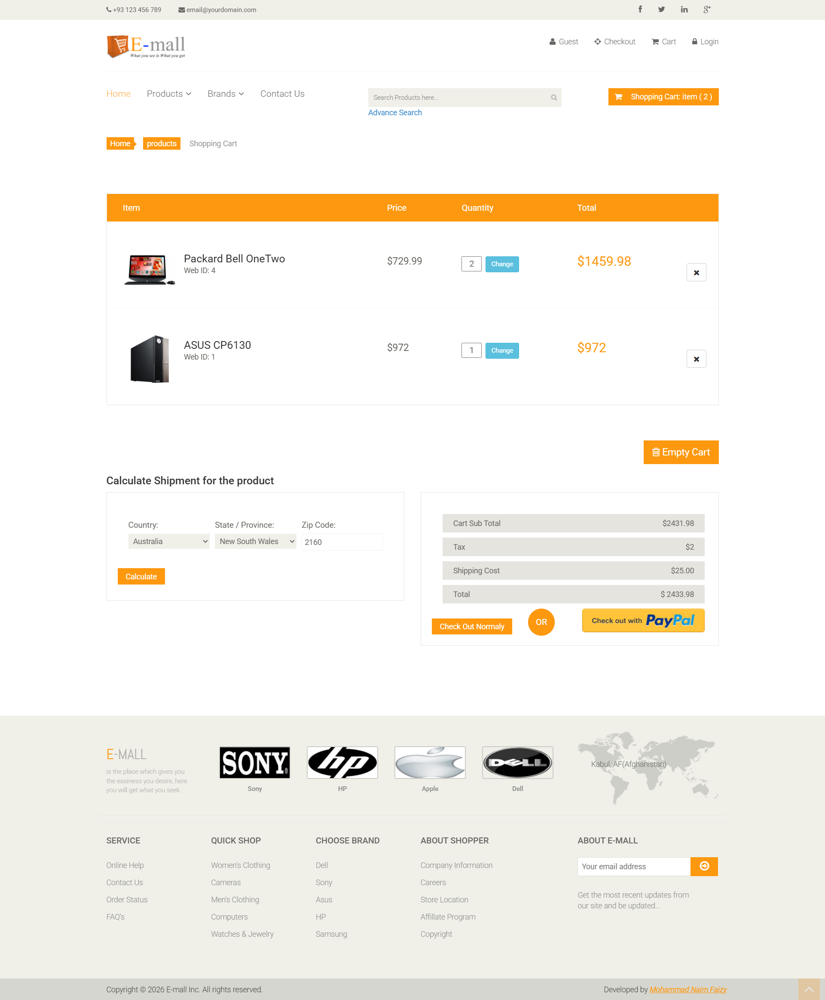
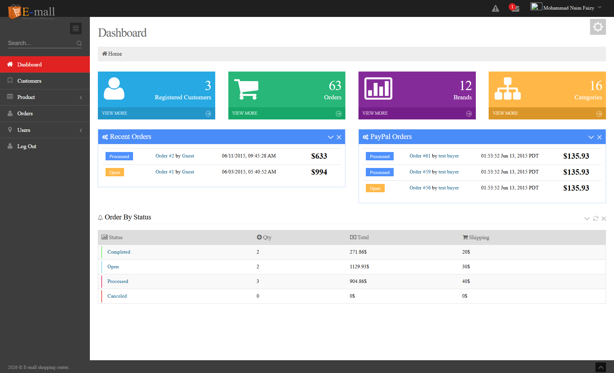
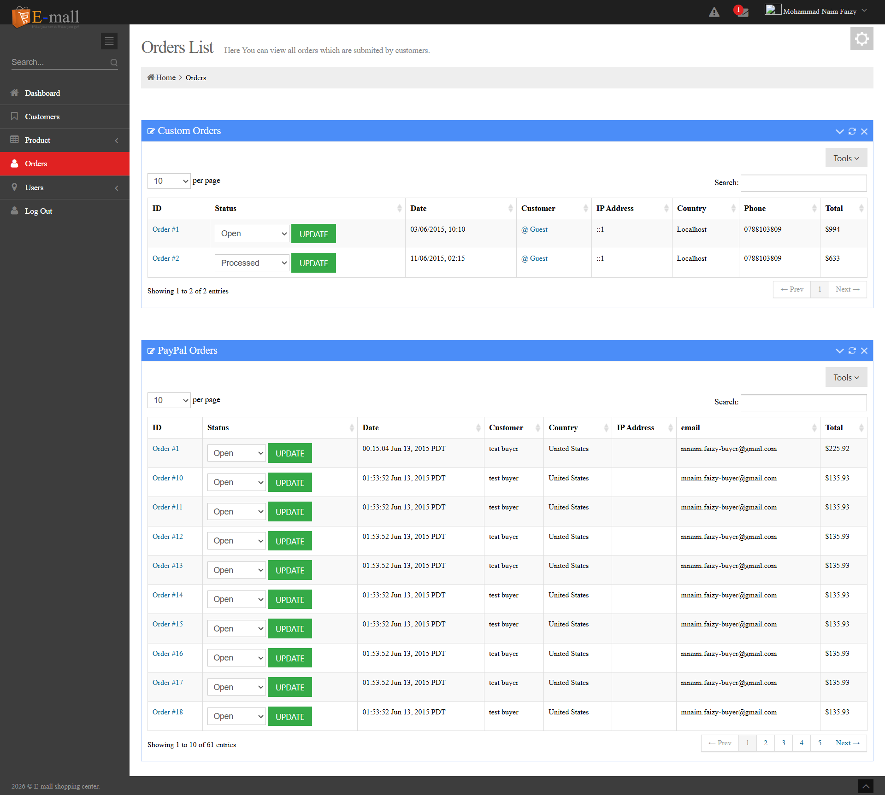
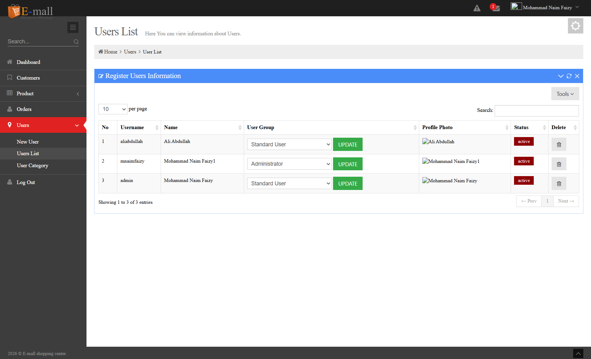

# PHP Electronic Mall - E-Commerce Platform

A complete, full-featured E-Commerce web application built with PHP and MySQL. This project was developed as a final year thesis project for university, with development spanning from **2014 to 2015**.


## Table of Contents

- [Overview](#overview)
- [Project History](#project-history)
- [Key Features](#key-features)
- [Technologies Used](#technologies-used)
- [System Architecture](#system-architecture)
- [Installation](#installation)
- [Configuration](#configuration)
- [Usage](#usage)
- [Admin Panel](#admin-panel)
- [Database Structure](#database-structure)
- [Payment Integration](#payment-integration)
- [Screenshots](#screenshots)
- [License](#license)

## Overview

PHP Electronic Mall is a comprehensive e-commerce solution that provides a complete online shopping experience. The platform allows customers to browse products, add items to their shopping cart, manage their orders, and complete purchases through multiple payment methods. Additionally, it features a robust administrative panel for managing all aspects of the online store.

This project demonstrates a full-stack web application implementation including user authentication, shopping cart functionality, order management, payment processing, and comprehensive administrative controls.

## Project History

This e-commerce platform was developed as a **final year thesis project** for university between **2014 and 2015**. The project aimed to create a fully functional online shopping platform demonstrating modern web development practices and e-commerce business logic implementation.

**Development Timeline:**

- **Started:** 2014
- **Completed:** 2015
- **Purpose:** Final Year University Thesis Project

## Key Features

### Customer-Facing Features

#### 🛍️ Shopping Experience

- **Product Catalog**: Browse extensive product listings with detailed information
- **Advanced Search**: Search products by name, category, sub-category, brand, price range, and condition
- **Product Details**: Comprehensive product pages with multiple images, specifications, and pricing
- **Image Gallery**: Multiple product images with zoom functionality
- **Product Reviews & Ratings**: Customer reviews and star ratings for products
- **Shopping Cart**: Session-based cart management with quantity adjustments
- **Wishlist**: Save favorite products for later purchase

#### 🏷️ Product Organization

- **Categories & Sub-Categories**: Hierarchical product organization including:
  - Computers (Laptops, Desktops, Tablets, etc.)
  - Car Electronics
  - TV & Video
  - Cell Phones
  - MP3 Players
  - Cameras
  - Sports (Bikes, Golf, Camping)
  - Fashion (Men's, Women's Clothing, Shoes)
  - Entertainment (Music, Movies, Video Games)
- **Brand Filtering**: Browse products by popular brands (Sony, HP, Apple, Dell, ASUS, Samsung)
- **Dynamic Slider**: Featured products carousel on homepage

#### 👤 User Management

- **User Registration**: New customer account creation
- **Login System**: Secure authentication with MD5 password hashing
- **Guest Checkout**: Purchase without creating an account
- **Remember Me**: Persistent login using cookies
- **User Profile**: Manage personal information and view order history

#### 📦 Order Management

- **Order Placement**: Complete checkout process with billing and shipping information
- **Order Tracking**: View order status and history
- **Order Cancellation**: Cancel orders when needed
- **Email Notifications**: Automated order confirmation emails
- **Invoice Generation**: PDF invoices for completed orders

#### 💳 Payment & Checkout

- **Multiple Payment Methods**:
  - PayPal Integration
  - Direct Bank Transfer
  - Check Payment
- **Shipping Calculator**: Dynamic shipping cost calculation based on location
- **Delivery Time Estimation**: Estimated delivery dates
- **Tax Calculation**: Automatic tax computation
- **Secure Checkout**: Multi-step checkout process with validation

#### 📧 Communication

- **Contact Form**: Contact page with Google Maps integration
- **Email Integration**: Automated email notifications for orders and inquiries

### Administrative Features

#### 🎛️ Dashboard

- **Statistics Overview**:
  - Total registered customers count
  - Total orders count
  - Total brands count
  - Total product categories count
- **Recent Orders**: Quick view of latest orders
- **Theme Customization**: Multiple color themes (Default, Blue, Brown, Purple, Light)
- **Fixed Header Option**: Customizable layout preferences

#### 📊 Product Management

- **Add New Products**: Complete product creation with:
  - Product name, category, sub-category
  - Brand selection
  - Price and condition (New/Used)
  - Detailed descriptions with rich text editor
  - Product status (Active/Inactive)
  - Stock management (In Stock/Out of Stock)
  - Quantity tracking
  - Slider inclusion option
- **Edit Products**: Update existing product information
- **Delete Products**: Remove products from catalog
- **Product Images**: Multi-image upload and management
- **Product List View**: Comprehensive product listing with filtering

#### 🏪 Catalog Management

- **Category Management**:
  - Create, edit, delete product categories
  - Category descriptions
  - Status management (Active/Inactive)
- **Sub-Category Management**: Hierarchical category organization
- **Brand Management**:
  - Add, edit, delete brands
  - Brand logo uploads
  - Brand status management

#### 📋 Order Management

- **Order List**: View all customer orders (regular and PayPal)
- **Order Details**: Comprehensive order information including:
  - Customer details
  - Products ordered with quantities
  - Billing information
  - Shipping information
  - Payment method
  - Order status
- **Status Updates**: Change order status (Open, Processing, Shipped, Delivered, Cancelled)
- **PayPal Orders**: Separate management for PayPal transactions
- **Order Deletion**: Remove orders from the system

#### 👥 Customer Management

- **Customer List**: View all registered customers
- **Customer Details**: Access customer information
- **Customer Orders**: View order history for each customer
- **PayPal Customers**: Manage customers who ordered via PayPal

#### 📄 Reporting & Export

- **PDF Generation**: Generate PDF reports using TCPDF library
- **Invoice Creation**: Create professional invoices for orders
- **Order Reports**: Export order lists for analysis

#### 🔐 User & Access Management

- **Admin Users**: Create and manage admin accounts
- **User Groups**: Assign user roles and permissions
- **User Profiles**: Manage admin user information
- **Login System**: Secure admin authentication

#### ⚙️ System Management

- **Shipping Settings**: Configure shipping options and pricing
- **Product Reviews**: Moderate customer product reviews
- **AJAX Operations**: Real-time updates for various operations
- **State/Region Management**: Dynamic location-based filtering

## Technologies Used

### Backend

- **PHP** (5.6+) - Server-side scripting language
- **MySQL** - Relational database management system
- **Apache** - Web server (via XAMPP/WAMP or Docker)

### Frontend

- **HTML5** - Markup language
- **CSS3** - Styling
  - Bootstrap 3.x - Responsive framework
  - Font Awesome - Icon library
  - Custom CSS (main.css, responsive.css)
- **JavaScript** - Client-side scripting
  - jQuery - JavaScript library
  - jQuery Validation - Form validation
  - prettyPhoto - Lightbox gallery
  - Magnific Popup - Modal windows
  - GMaps - Google Maps integration

### Libraries & Frameworks

- **Bootstrap 3.x** - Responsive CSS framework
- **TCPDF** - PDF generation library
- **jQuery** - JavaScript framework
- **Font Awesome** - Icon font library

### Development Tools

- **Docker** - Containerization (docker-compose.yml included)
- **phpMyAdmin** - Database management

## System Architecture

### Directory Structure

```
php-electronic-mall/
├── admin/                      # Administrative panel
│   ├── ajax/                  # AJAX handlers for admin
│   ├── assets/                # Admin assets (CSS, JS, images)
│   ├── includes/              # Admin PHP includes
│   ├── sql/                   # Database schema
│   ├── tcpdf/                 # PDF generation library
│   ├── brand.php              # Brand management
│   ├── customer_list.php      # Customer management
│   ├── index.php              # Admin dashboard
│   ├── login.php              # Admin login
│   ├── orders.php             # Order management
│   ├── product.php            # Product management
│   ├── product_list.php       # Product listing
│   └── ...
├── ajax/                       # AJAX handlers for frontend
├── css/                        # Frontend stylesheets
├── fonts/                      # Web fonts
├── images/                     # Product and site images
│   ├── brands/                # Brand logos
│   ├── product_images/        # Product photos
│   └── ...
├── includes/                   # PHP include files
│   ├── header.php             # Site header
│   ├── footer.php             # Site footer
│   ├── navigation.php         # Navigation menu
│   └── database.php           # Database connection
├── js/                         # JavaScript files
├── mysql_data/                 # MySQL data directory (Docker)
├── index.php                   # Homepage
├── cart.php                    # Shopping cart
├── checkout.php                # Checkout process
├── login.php                   # Customer login
├── products.php                # Product listing
├── product_detail.php          # Product details
├── orders.php                  # Customer orders
├── contact_us.php              # Contact form
├── payment.php                 # Payment processing
├── docker-compose.yml          # Docker configuration
├── Dockerfile                  # Docker image definition
└── README.md                   # This file
```

## Installation

### Prerequisites

- PHP 5.6 or higher
- MySQL 5.6 or higher
- Apache Web Server
- Docker (optional, for containerized deployment)

### Using Docker (Recommended)

1. **Clone the repository**

   ```bash
   git clone <repository-url>
   cd php-electronic-mall
   ```

2. **Start Docker containers**

   ```bash
   docker compose up --build -d
   ```

3. **Import the database**
   - Access phpMyAdmin at `http://localhost:8080`
   - Create a database named `php_electronic_mall`
   - Import the SQL file from `admin/sql/php_electronic_mall.sql`

4. **Access the application**
   - Frontend: `http://localhost`
   - Admin Panel: `http://localhost/admin`

### Manual Installation

1. **Clone or download the project**

   ```bash
   git clone <repository-url>
   ```

2. **Set up the web server**
   - Install XAMPP/WAMP/LAMP
   - Copy project files to web server directory (e.g., `htdocs/`)

3. **Create the database**
   - Open phpMyAdmin
   - Create a new database: `php_electronic_mall`
   - Import the SQL file: `admin/sql/php_electronic_mall.sql`

4. **Configure database connection**
   - Edit `admin/includes/database.php`
   - Update database credentials:
     ```php
     $db_host = "localhost";
     $db_name = "php_electronic_mall";
     $db_user = "root";
     $db_pass = "";
     ```

5. **Set file permissions**

   ```bash
   chmod -R 755 images/
   chmod -R 755 admin/images/
   ```

6. **Access the application**
   - Navigate to `http://localhost/php-electronic-mall`

## Configuration

### Database Configuration

Update database settings in `admin/includes/database.php`:

```php
define("DB_SERVER", "localhost");
define("DB_USER", "root");
define("DB_PASS", "");
define("DB_NAME", "php_electronic_mall");
```

### PayPal Configuration

Configure PayPal settings in the payment processing files:

- Update PayPal merchant email
- Set PayPal API credentials
- Configure return URLs

### Email Configuration

Update SMTP settings in `sendemail.php` for email notifications.

## Usage

### Customer Usage

1. **Browse Products**: Visit the homepage to see featured products and categories
2. **Search**: Use the advanced search to find specific products
3. **Add to Cart**: Click "Add to Cart" on product pages
4. **Checkout**:
   - Review cart items
   - Enter shipping information
   - Select payment method
   - Complete purchase
5. **Track Orders**: Login to view order history and status

### Admin Usage

1. **Login**: Access `http://yoursite.com/admin` and login with admin credentials
2. **Manage Products**:
   - Add new products with images
   - Edit existing products
   - Update stock quantities
3. **Process Orders**:
   - View new orders
   - Update order status
   - Generate invoices
4. **Manage Customers**: View customer list and order history
5. **Configure Settings**: Update categories, brands, and shipping options

### Default Admin Credentials

```
Email: mnaimfaizy@yahoo.com
Password: password
```

**Note**: Change these credentials immediately after installation.

## Admin Panel

The administrative panel provides comprehensive control over the entire e-commerce platform:

### Dashboard Features

- Real-time statistics
- Recent orders overview
- Quick access to key functions
- Customizable theme colors

### Key Admin Functions

- Product CRUD operations
- Order management and tracking
- Customer relationship management
- Inventory management
- Report generation
- Content management
- System configuration

### Admin Routes

- `/admin/index.php` - Dashboard
- `/admin/product.php` - Add/Edit Products
- `/admin/product_list.php` - Product List
- `/admin/orders.php` - Order Management
- `/admin/customer_list.php` - Customer Management
- `/admin/brand.php` - Brand Management
- `/admin/product_category.php` - Category Management

## Database Structure

The application uses a relational MySQL database with the following main tables:

### Core Tables

- **product** - Product information (name, price, description, stock, etc.)
- **images** - Product images
- **product_category** - Product categories
- **product_sub_category** - Product sub-categories
- **brand** - Product brands

### User & Order Tables

- **customer** - Registered customer accounts
- **orders** - Customer orders
- **product_order** - Order items (junction table)
- **paypal_checkout** - PayPal transactions
- **billing** - Billing addresses
- **product_shippment** - Shipping addresses

### Other Tables

- **product_review** - Customer product reviews
- **shipping** - Shipping configuration
- **user** - Admin users
- **user_group** - Admin user roles

## Payment Integration

### PayPal Integration

The platform includes **PayPal payment gateway integration**, allowing customers to:

- Pay securely via PayPal
- Use PayPal Express Checkout
- Process refunds through PayPal

PayPal orders are tracked separately in the admin panel with dedicated management features.

### Alternative Payment Methods

- **Direct Bank Transfer**: Manual payment verification
- **Check Payment**: Traditional check processing

## Screenshots

### Customer Interface

#### Homepage


_Homepage featuring product slider, category navigation, and featured products_

#### Shopping Cart


_Shopping cart with item management, shipping calculation, and checkout options_

### Admin Panel

#### Admin Dashboard


_Admin dashboard with statistics, recent orders, and quick access controls_

#### Order Management


_Order management interface for processing and tracking customer orders_

#### User Management


_User management panel for managing customer accounts and permissions_

## Security Considerations

**Note**: This project was developed in 2014-2015 and uses older security practices:

- Passwords are hashed with MD5 (consider upgrading to bcrypt/password_hash)
- SQL queries should be updated to use prepared statements to prevent SQL injection
- Input validation and sanitization should be enhanced
- CSRF protection should be implemented
- Session security should be improved

**For production use, please update security implementations to modern standards.**

## Future Enhancements

Potential improvements for this project:

- Upgrade to PHP 7.4+ with modern security practices
- Implement prepared statements for all database queries
- Add password hashing with bcrypt
- Implement responsive design improvements
- Add more payment gateways (Stripe, Square, etc.)
- Implement REST API
- Add product comparison feature
- Implement social media integration
- Add real-time chat support
- Implement advanced analytics

## License

This project is licensed under the MIT License - see the [LICENSE](LICENSE) file for details.

## Acknowledgments

- Developed as a final year university thesis project (2014-2015)
- Bootstrap framework for responsive design
- TCPDF library for PDF generation
- Font Awesome for icons
- jQuery and associated plugins

## Contact

For questions or feedback about this project, please contact through the repository.

---

**Developed with ❤️ as a Final Year University Thesis Project (2014-2015)**
